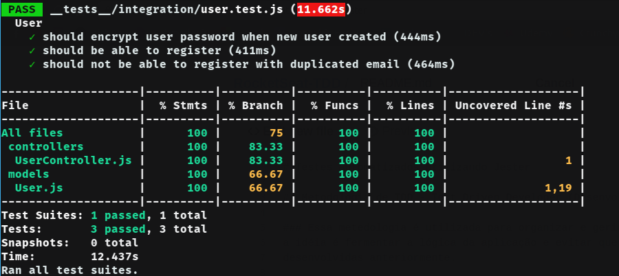
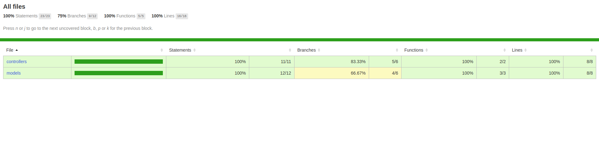
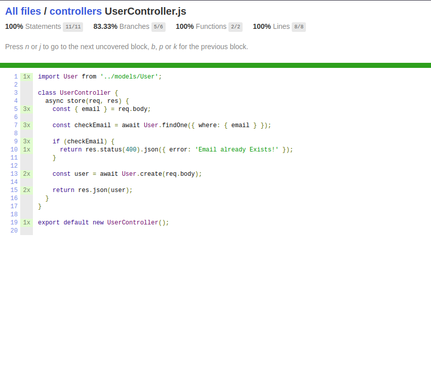

# Testes Automatizados utilizando Jester

## Metodologia de TDD - Test Driven Developer (Desenvolvimento dirigido a testes)

* Essa metedologia é utilizada para organizar e gerir as regras de négocio antes mesmo de começar o desenvolvimento,  
a idéia é fermentar a lógica da aplicação e evitar que novas features acrescentadas ao código não impactem nas features  
desenvolvidas anteriormente.

* Inicialmente contruimos o teste com o intuito dele falhar (red), depois fazemos a codificação para a feature passar 
no teste (green) em seguida, fazemos a refatoração e deixamos o código nos patterns necessrios para futuras manutenções  
(refactoring)

* Isso tudo resume o TDD, e os testes unitarios de integração, que consiste na ideia de RED, GREEN, REFACTORIN.

## Essa aplicação requer uma versão LTS ou superior do NodeJS, o gerenciador de pacote NPM ou YARN.

* Ao clonar o repositório, comece instalando as dependências com o comando ```yarn``` ou ```npm i```

## Para executar os testes dessa aplicação basta rodar: ```yarn test```

* Ao rodar os testes um relatório de testes que passaram e que falharam será gerado no terminal:
<h1 align="center">
    
</h1>

## Para ver as informações dos testes mais detalhadas, pode olhar pelo index.html gerado pelo Jester, ao final de todo novo  
teste realizado, o caminho do arquivo é ./__tests__/couverage/lcov-report/index.html

<h1 align="center">
    
</h1>

<h1 align="center">
    
</h1>

###### créditos a Rocketseat :wave: [Faça parte dessa comunidade!](https://discordapp.com/invite/gCRAFhc)
